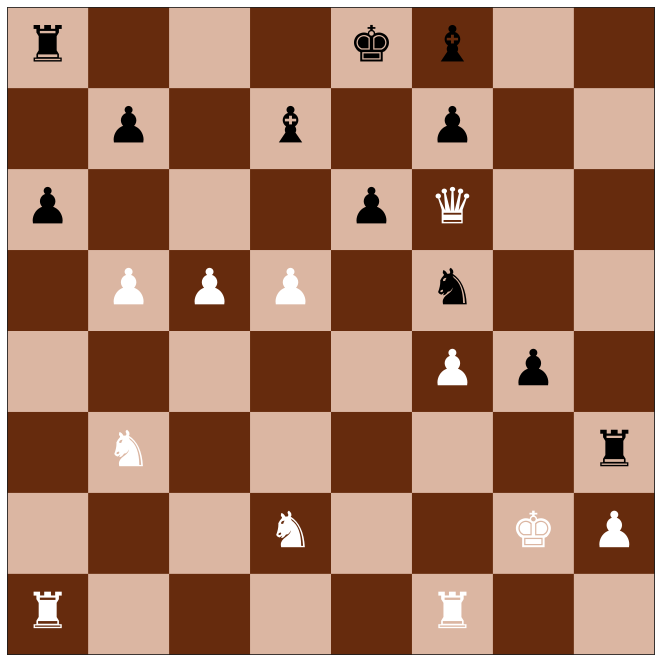

# Introduction
This repo contains links to the eight datasets we generated for use in the NAS Unseen Data Challenges, held at the Neural Architecture Workshop at CVPR 2021, 2022, and 2023. We also show benchmark results to compare against in future works.

For a more detailed description of these datasets, please refer to out paper, accepcted at CVPR 2024:

Link Coming soon.

# Datasets
Below we will briefly describe and link to each dataset.

## AddNIST

## Language

## MultNIST

## CIFARTile

## Gutenberg

## GeoClassing

## Isabella

Code Coming Soon.

## Chesseract

 

# Baseline Results

## CNN Results

## NAS Results

## Competition Results

## 2023 Top five finalists

## Best Competition Results

# Reference
Coming Soon