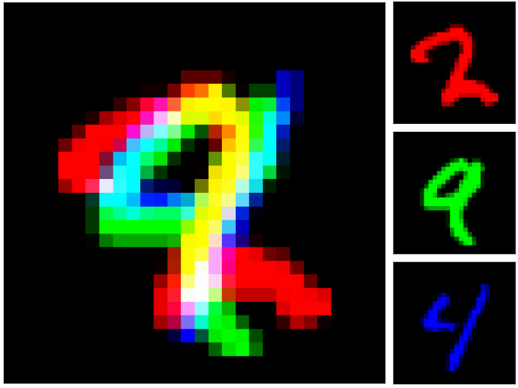
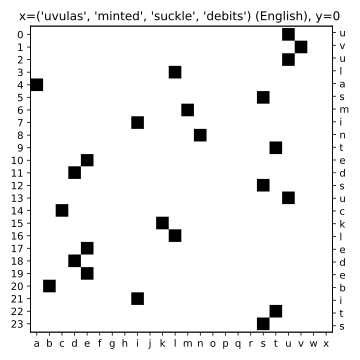
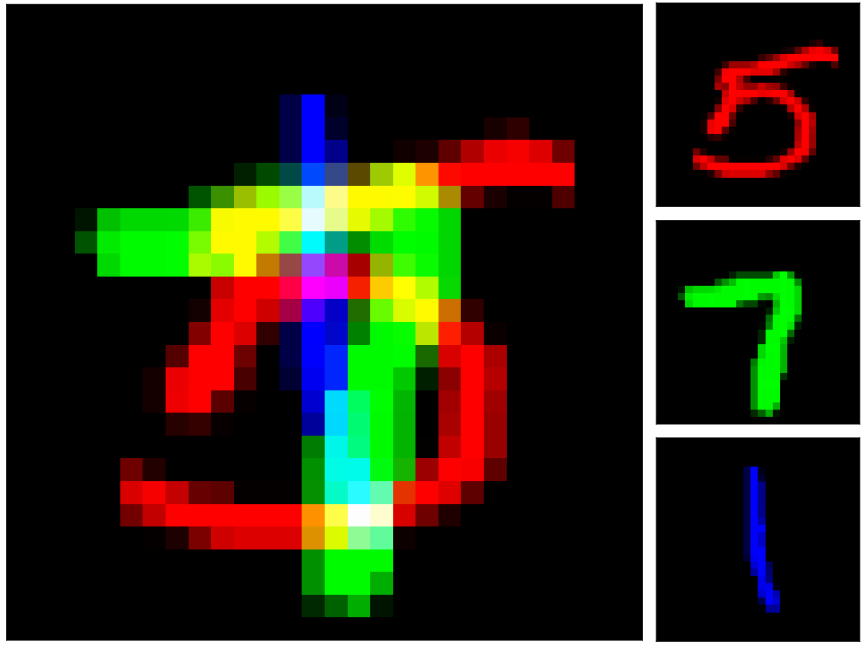
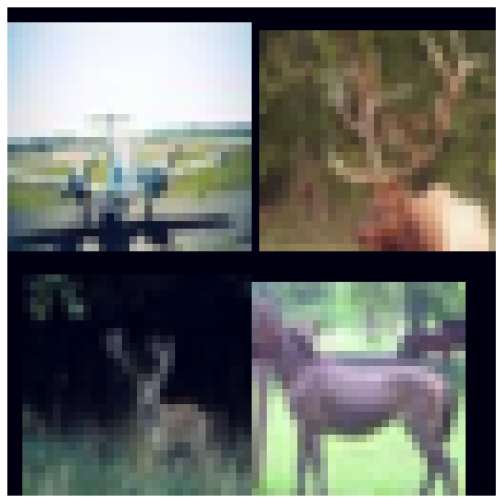
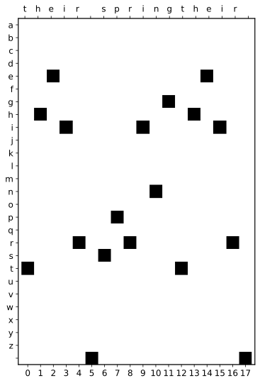
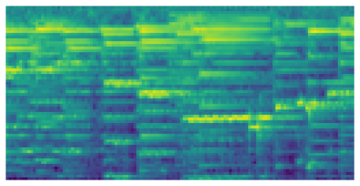
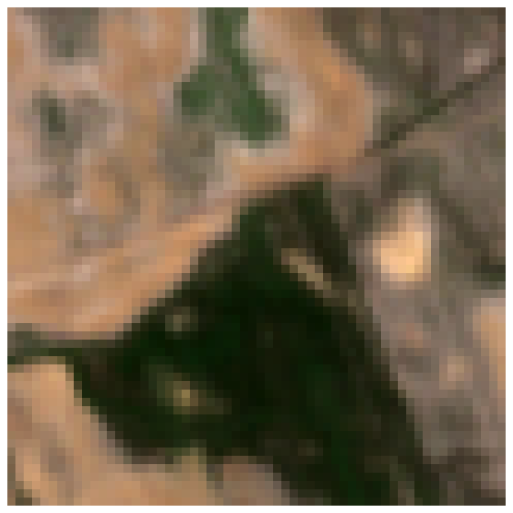
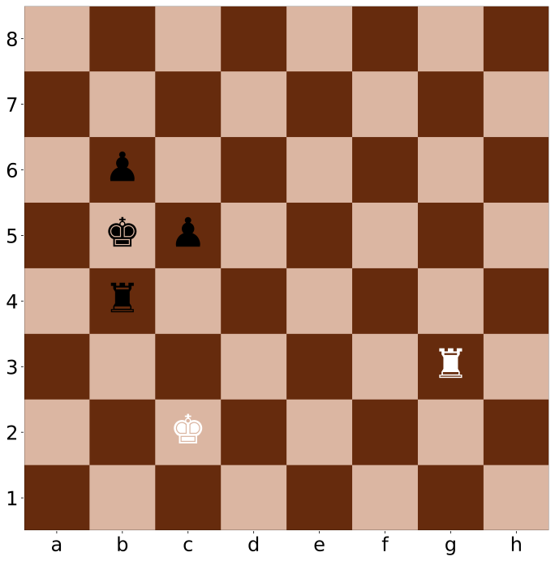
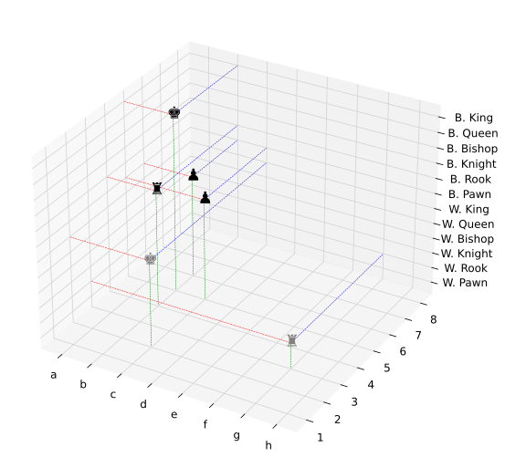

# Introduction
This repo contains links to the eight datasets we generated for use in the NAS Unseen Data Challenges, held at the Neural Architecture Workshop at CVPR 2021, 2022, and 2023. We also show benchmark results to compare against in future works.

For a more detailed description of these datasets, please refer to out paper, accepcted at CVPR 2024:

Link Coming soon.

# Datasets
Below we will briefly describe and link to each dataset.

## AddNIST

AddNIST is generated by combining three MNIST Images. Each image is given a label which is the sum of the three sub-images minus one. In the above example the label would be 14. (((2 + 9 + 4) - 1) = 14).

The labels are limited between 0 - 19, giving a total of 20 classes. The dataset can be found at [data.ncl.ac.uk/articles/dataset/AddNIST_Dataset/24574354](https://data.ncl.ac.uk/articles/dataset/AddNIST_Dataset/24574354)

## Language

The language dataset is constructed using the ASPELL dictionary to collect words from multiple languages. Ten languages were chosen (English, Dutch, German, Spannish, French, Portuguese, Swedish, Zulu, Swahili, and Finnish).

The example above shows an image generated using the English label. Four words were chosen randomly from ASPELL (Uvulas, minted, suckle, and debits) and encoded into a 24x24 image. The y-axis depicts the character position in the concatenated 24-character string, and the x-axis represents the corresponding letter. For simplicity, words containing diacritics, or the letters 'y' and 'z' were removed before selection.

The dataset can be found at [data.ncl.ac.uk/articles/dataset/Language_Dataset/24574729](https://data.ncl.ac.uk/articles/dataset/Language_Dataset/24574729)

## MultNIST

Similar in design to AddNIST, MultNIST is also made up of three MNIST images. Instead of performing a summation, MultNIST labels are generated by multiplying the three sub-images together and performing a mod 10 operation on the result, which results in ten possible labels 0-9. In the example above the label would be 5. ((5 * 7 * 1) = 35. 35 mod 10 = 5).

The dataset can be found at [data.ncl.ac.uk/articles/dataset/MultNIST_Dataset/24574678](https://data.ncl.ac.uk/articles/dataset/MultNIST_Dataset/24574678)

## CIFARTile

CIFARTile is comprised of four CIFAR-10 images. The label of a CIFARTile image denotes how many unique CIFAR-10 labels from the sub-images are in the Image (i.e. a label of 0 means all four sub-images belong to the same CIFAR-10 class). This means there can be four labels, with a label of 3 denoting all sub-images belong to different classes.

The dataset can be found at [data.ncl.ac.uk/articles/dataset/CIFARTile_Dataset/24551539](https://data.ncl.ac.uk/articles/dataset/CIFARTile_Dataset/24551539)

## Gutenberg

Gutenberg is encoded similarly to Language, however, instead of representing words from different languages, Gutenberg encodeds three words extracted from public domain texts from Project Gutenberg (Note. these works are in the public domain in the US, please check your countries copyright law, before downloading).

In the example above, a three word string was selected from one of Shakespeare's works. The words that had less than six letters were padded with spaces, then we encoded it onto image similarly to Language.

The dataset can be found at [data.ncl.ac.uk/articles/dataset/Gutenberg_Dataset/24574753](https://data.ncl.ac.uk/articles/dataset/Gutenberg_Dataset/24574753)

## Isabella

Isabella was generated by creating spectrograms of five second clips of music, taken from the online archive of the Isabella Stewart Gardner Museum, Boston. The images are classified based on the "type" of music they represent, as denoted by the the museum. The example above is labelled "20th Century".

The available labels are: Baroque, Classical, Romantic, and 20th Century.

Due to license issues, we are unable to provide the dataset itself, however, we will soon publish code allowing the generation of an Isabella-like dataset. Code Coming Soon.

## GeoClassing

GeoClassing was generated using the BigEarthNet dataset, using images from the European Space Agency Sentinel satellite. This dataset contains images of european countries. We randomly selected images from their patches and labelled them according to the country the patch belongs to. The available countries (and thus labels) are: Austria, Belgium, Finland, Ireland, Kosovo, Lithuania, Luxembourg, Portugal, Serbia, and Switzerland. The example image above was taken over Portugal, and has that as a label.

The dataset can be found at [data.ncl.ac.uk/articles/dataset/GeoClassing_Dataset/24050256](https://data.ncl.ac.uk/articles/dataset/GeoClassing_Dataset/24050256)

## Chesseract
 

The Chesseract dataset is generated by representing the board state of a game of chess as an image. Using publicly available chess games of grandmasters, we create a three-dimensional array, where x and y represent the ranks and files a chess board, and the z-axis represents a one-hot encoding of the piece type and colour (See the 3D rendering above.).

The images above are representations of the dataset, as the actual dataset represents the pieces as 1s.

The dataset can be found at [data.ncl.ac.uk/articles/dataset/Chesseract_Dataset/24118743](https://data.ncl.ac.uk/articles/dataset/Chesseract_Dataset/24118743)

# Generation
You can find the code to generate five of the eight datasets at [github.com/RobGeada/cvpr-nas-datasets](https://github.com/RobGeada/cvpr-nas-datasets). We plan on releasing the code for generating the other datasets soon.

# Baseline Results
Here we show tables that include results on our datasets. We have generated results on a number of "off-the-shelf" CNNs and three published NAS methods. We also show a few results from the competition.

## CNN Results
| Dataset     | ResNet-18 | AlexNet | VGG16  | ConvNext | MNASNet | DenseNet | ResNeXt |
|-------------|-----------|---------|--------|----------|---------|----------|---------|
| AddNIST     |    92.08% |  94.87% | 92.06% |   38.06% |  90.51% |   93.52% |  91.42% |
| Language    |    97.00% |  85.71% | 84.54% |   83.40% |  84.63% |   84.57% |  93.97% |
| MultNIST    |    91.55% |  94.01% | 90.43% |   64.20% |  87.70% |   92.81% |  90.57% |
| CIFARTile   |    45.56% |  48.88% | 24.43% |   31.06% |  48.49% |   51.28% |  46.23% |
| Gutenberg   |    49.98% |  45.53% | 44.00% |   31.93% |  38.00% |   43.28% |  40.30% |
| Isabella    |    62.02% |  61.37% | 58.13% |   57.18% |  60.69% |   63.27% |  60.46% |
| GeoClassing |    80.33% |  92.49% | 93.67% |   72.76% |  86.00% |   94.21% |  89.99% |
| Chesseract  |    57.83% |  57.45% | 55.69% |   52.74% |  56.26% |   59.60% |  55.15% |

## NAS Results

| Dataset     | PC-DARTS | DrNAS  | Bonsai-Net  | Random DARTS | Random Bonsai |
|-------------|----------|--------|-------------|--------------|---------------|
| AddNIST     |   96.60% | 97.06% |      97.91% |       97.07% |        34.17% |
| Language    |   90.12% | 88.55% |      87.65% |       90.12% |        76.83% |
| MultNIST    |   96.68% | 98.10% |      97.17% |       96.55% |        39.76% |
| CIFARTile   |   92.28% | 81.08% |      91.47% |       90.74% |        24.76% |
| Gutenberg   |   49.12% | 46.62% |      48.57% |       47.72% |        29.00% |
| Isabella    |   65.77% | 64.53% |          -% |       66.35% |        58.53% |
| GeoClassing |   94.61% | 96.03% |      95.66% |       95.54% |        63.56% |
| Chesseract  |   57.20% | 58.24% |      60.76% |       59.16% |        68.83% |

## Competition Results
Below you can see the results of the top five finalists of the 2023 version of the competition. 2023 was evaluated on Isabella, GeoClassing, and Chesseract. We also report the best result generated by submissions to the competition across all eight of our datasets.

### 2023 Top five finalists

### Best Competition Results

# Reference
Coming Soon

# License

<a property="dct:title" rel="cc:attributionURL" href="https://github.com/Towers-D/NAS-Unseen-Datasets">NAS Unseen Datasets</a> by <a rel="cc:attributionURL dct:creator" property="cc:attributionName" href="http://davidtowers.uk">David Towers, Rob Geada, Amir Atapour-Abarghouei, Stephen McGough</a> is licensed under <a href="http://creativecommons.org/licenses/by/4.0/?ref=chooser-v1" target="_blank" rel="license noopener noreferrer" style="display:inline-block;">CC BY 4.0</a>
